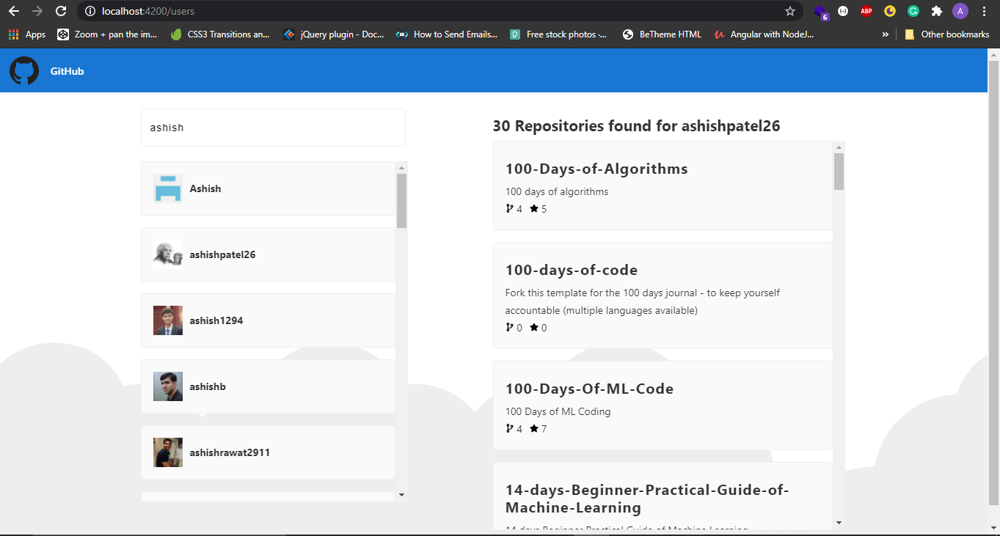

# Github User Application

This project was generated with [Angular CLI](https://github.com/angular/angular-cli) version 10.0.1.

## Display

## Description
In this application clientside user can view GitHub users when application was loaded. He/She can search user from GitHub also when clicked on user it's automatically show the selected user repositories with total number of repositories, total fork count and star count in a particular repository.

## Development server

Run `ng serve` for a dev server. Navigate to `http://localhost:4200/`. The app will automatically reload if you change any of the source files.

## Code scaffolding

Run `ng generate component component-name` to generate a new component. You can also use `ng generate directive|pipe|service|class|guard|interface|enum|module`.

## Build

Run `ng build` to build the project. The build artifacts will be stored in the `dist/` directory. Use the `--prod` flag for a production build.

## Further help

To get more help on the Angular CLI use `ng help` or go check out the [Angular CLI README](https://github.com/angular/angular-cli/blob/master/README.md).
